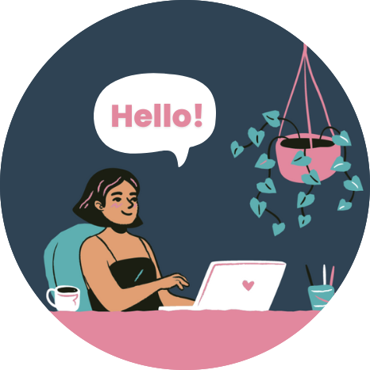

  

 
 

<strong> Hello! My name is Breanda</strong>

I’m a front-end developer based in Tokyo, Japan with roots in Houston, Texas. Currently, I am sharpening my skills in React Development. I have a passion for creating seamless web experiences with user-friendly design.

 

  <strong>🌱 Currently focusing on...</strong>
  <ul>
    <li>
      <a href="https://www.theodinproject.com/paths/foundations/courses/foundations" title="The Odin Project"><strong>The Odin Project: Foundations</strong></a>
    </li>
  </ul>
  

   
 

  <strong>🖥️ Projects I've built...</strong>
   <ul>
    <li>
      <a href="https://github.com/breandabarnett/dictionary-project" title="React.Dictionary GitHub Repo"><strong>React.Dictionary App</strong></a>
    </li>
    <li>
      <a href="https://github.com/breandabarnett/react-weather-app" title="Aqua Weather GitHub Repo"><strong>Aqua Weather App</strong></a>
     </li>
     <li>
      <a href="https://github.com/breandabarnett/odin-recipes" title="Odin Recipes GitHub Repo"><strong>Odin Recipes Blogsite</strong></a>
     </li>
    <li>
      <a href="https://github.com/breandabarnett/houseplant-landing-page" title="Houseplant Page GitHub Repo"><strong>Houseplant for Small Spaces Quiz Page</strong></a>
    </li>
  </ul>
  

  

<strong>💎 Fun facts...</strong>
<ul>
  <li>
    I started learning web development March '22.
  </li>
  <li>
    I enjoy playing cozy video games like ACNH & Stardew Valley!
  </li>
 </ul>

 
 

  <strong>📮 Let's connect & inspire each other!</strong>

  
   
   
   

 
 

  <strong>
     Toolkit & Technologies
  </strong>

   
  
  
  
  
  
  

  
  
  
  
  
  

  
  
  
  

 
 
 

