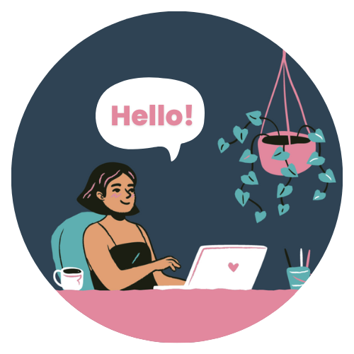

  

 
 

<strong><h3>Hello! My name is Breanda Barnett.</h3></strong>

I’m a front-end developer based in Tokyo, Japan with roots in Houston, Texas. Currently, I am sharpening my skills in React Development. I have a passion for creating seamless web experiences with user-friendly design. As I embark on a career in tech, I'm excited to find front-end development opportunities within Japan or the USA.

 

<strong><em>Fun facts:</em></strong>
 
I started learning web development March '22.
 
I enjoy playing cozy video games like ACNH & Stardew Valley!

 
 

<h3>Let's connect & inspire each other! </h3>

   
  
   

 

 

  <h3>
    Toolkit & Technologies
    
  </h3>

  
  
  
  
  

  
  
  
  
  
  <a href="https://codepen.io/willowbrii">
    

 

